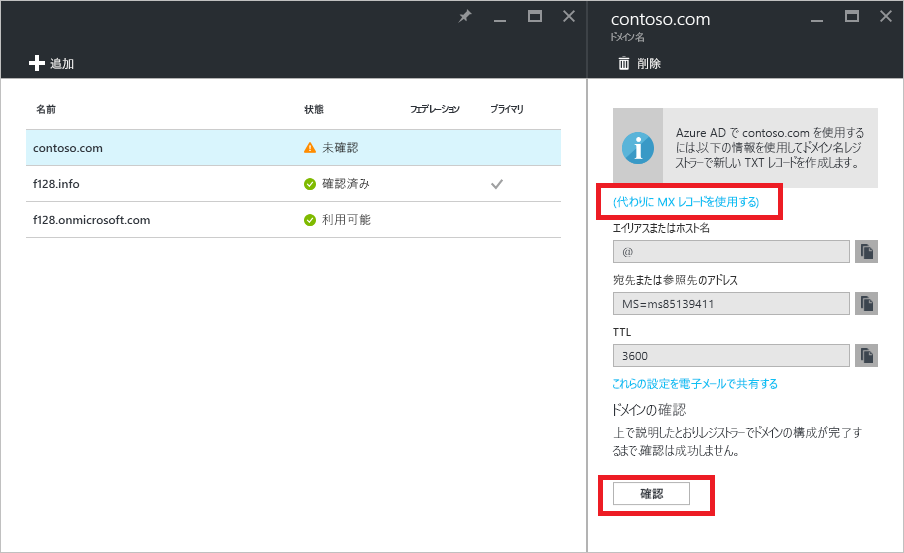

# クイック スタート: カスタム ドメイン名を Azure Active Directory に追加する

Azure AD ディレクトリにはすべて、*domainname*.onmicrosoft.com の形式の初期ドメイン名が付いています。 初期ドメイン名は変更も削除もできませんが、企業ドメイン名を Azure AD に追加することもできます。 たとえば、組織には多くの場合、ビジネスを行うために使用する別のドメイン名と、企業ドメイン名を使用してサインインするユーザーが存在します。 Azure AD にカスタム ドメイン名を追加すると、ディレクトリ内で、"alice@contoso.com" のようなユーザーにとって馴染みのあるユーザー名を、 "alice@*<ドメイン名>*.onmicrosoft.com" の代わりに割り当てることができます。 この場合のプロセスは単純です。

1. カスタム ドメイン名をディレクトリに追加する
2. ドメイン名レジストラーでドメイン名の DNS エントリを追加する
3. Azure AD でカスタム ドメイン名を検証する

## カスタム ドメイン名をディレクトリに追加する
1. ディレクトリの全体管理者であるアカウントで [Azure Portal](https://aad.portal.azure.com/#blade/Microsoft_AAD_IAM/ActiveDirectoryMenuBlade/Overview) にサインインします。
2. 左側で **[カスタム ドメイン名]** を選択します。
3. **[カスタム ドメインの追加]** を選択します。
   
   ![[追加] コマンドをクリックする](./media/add-custom-domain/add-custom-domain.png)
5. **[カスタム ドメイン名]** で、ボックスにカスタム ドメインの名前 ("contoso.com" など) を入力し、**[ドメインの追加]** を選択します。 必ず、.com、.net、その他の上位拡張子を含めます。
6. ***[<ドメイン名>]*** (つまり、新しいドメイン名がタイトルになっている画面) で必要な DNS エントリ情報を収集し、Azure AD でカスタム ドメイン名を確認するために後で使用します。
   
   

> [!TIP]
> オンプレミスの Windows Server AD を Azure AD とフェデレーションする予定の場合は、ディレクトリを同期するために Azure AD Connect ツールを実行する際に **[このドメインを構成して、ローカル Active Directory にシングル サインオンします]** チェックボックスをオンにする必要があります。 また、ウィザードの **[Azure AD ドメイン]** の手順で、オンプレミスのディレクトリとフェデレーションするために選択したのと同じドメイン名を登録する必要があります。 ウィザードの手順の表示内容は [こちらの手順](./../connect/active-directory-aadconnect-get-started-custom.md#verify-the-azure-ad-domain-selected-for-federation)で確認できます。 Azure AD Connect ツールをお持ちでない場合は、 [こちらからダウンロード](http://go.microsoft.com/fwlink/?LinkId=615771)できます。

## ドメイン名レジストラーでドメイン名の DNS エントリを追加する
Azure AD でカスタム ドメイン名を使用できるようにするために、次の手順としてドメインの DNS ゾーン ファイルを更新します。 これにより、組織がそのカスタム ドメイン名を所有していることを Azure AD で確認できます。 Azure 内の Azure/Office 365/external の DNS レコードに [Azure DNS](https://docs.microsoft.com/azure/dns/dns-getstarted-portal) を使用するか、または、[異なる DNS レジストラー](https://support.office.com/article/Create-DNS-records-for-Office-365-when-you-manage-your-DNS-records-b0f3fdca-8a80-4e8e-9ef3-61e8a2a9ab23/)で DNS エントリを追加できます。

1. ドメインのドメイン名レジストラーにサインインします。 DNS エントリを更新するアクセス権がない場合は、アクセス権を持つ人物またはチームに連絡し、手順 2. の実行と、完了後の連絡を依頼します。
2. Azure AD から提供された DNS エントリを追加し、ドメインの DNS ゾーン ファイルを更新します。 メール ルーティングや Web ホスティングなどの動作は変更されません。

## Azure AD でカスタム ドメイン名を検証する
DNS エントリを追加すると、Azure AD でドメイン名を検証することができるようになります。 DNS レコードが反映された後でないと、ドメイン名を検証できません。 反映には数秒しかかからない場合がほとんどですが、1 時間以上かかる場合もあります。 最初から検証が機能しない場合は、後でもう一度やり直してください。

1. テナントの全体管理者であるアカウントで [Azure AD](https://aad.portal.azure.com/#blade/Microsoft_AAD_IAM/ActiveDirectoryMenuBlade/Overview) にサインインします。
2. **[カスタム ドメイン名]** を選択します。
3. 検証したい未確認のドメイン名を選択します。
4. エントリを確認し、**[Verify]\(検証\)** を選択して検証を完了します。

これで [カスタム ドメイン名を含んだユーザー名を割り当てる](../users-groups-roles/domains-manage.md)ことができます。 カスタム ドメイン名を使用して、クラウドベースのユーザー アカウントを作成したり、以前に同期したオンプレミスのユーザー アカウント情報を更新したりすることができるようになりました。 また、同期したユーザー アカウントのドメイン サフィックス情報を、[Microsoft PowerShell](https://msdn.microsoft.com/library/azure/e1ef403f-3347-4409-8f46-d72dafa116e0#BKMK_ManageDomains) または [Graph API](https://msdn.microsoft.com/Library/Azure/Ad/Graph/api/domains-operations) を使用して変更することもできます。

> [!TIP]
> 管理対象ドメインの名前は最大 900 件追加できます。 Active Directory とのオンプレミスのフェデレーション用にすべてのドメインを構成している場合、各ディレクトリに最大 450 件のドメイン名を追加できます。 詳細については、「[フェデレーション ドメイン名および管理対象ドメイン名](https://docs.microsoft.com/azure/active-directory/active-directory-add-domain-concepts#federated-and-managed-domain-names)」を参照してください。

## トラブルシューティング
カスタム ドメイン名を確認できない場合は、以下のトラブルシューティング手順を試してください。

1. **1 時間待つ**。 DNS レコードは、Azure AD がドメインを検証する前に反映されている必要があります。 このプロセスに 1 時間以上かかることがあります。
2. **DNS レコードが正しく入力されていることを確認する**。 ドメインのドメイン名レジストラーの Web サイトで、この手順を実行します。 Azure AD は次の場合にドメイン名を検証できません。 
  * DNS エントリが DNS ゾーン ファイルに存在しない
  * Azure AD が提供した DNS エントリと完全一致しない 
  
  ドメインの DNS レコードをドメイン名レジストラーで更新するアクセス権がない場合は、組織内でそのアクセス権を持つ人物またはチームと DNS エントリを共有し、DNS エントリの追加を依頼します。
3. **Azure AD の他のディレクトリから、そのドメイン名を削除する**。 ドメイン名は、1 つのディレクトリ内だけでしか検証できません。 ドメイン名が現在、別のディレクトリで検証済みになっている場合、もう一方のディレクトリで削除されるまで、新しいディレクトリでは検証できません。 ドメイン名の削除については、[カスタム ドメイン名の管理](../users-groups-roles/domains-manage.md)に関する記事を参照してください。    

各ドメイン名を追加するには、この記事の手順を繰り返してください。

## 詳細情報
[Azure AD でのカスタム ドメイン名の概念の概要](../users-groups-roles/domains-manage.md)

[カスタム ドメイン名を管理する](../users-groups-roles/domains-manage.md)

## 次の手順
このクイックスタートでは、カスタム ドメインを Azure AD に追加する方法について説明しました。 

次のリンクを使用して、Azure Portal から、新しいカスタム ドメインを Azure AD に追加することができます。

> [!div class="nextstepaction"]
> [カスタム ドメインの追加](https://aad.portal.azure.com/#blade/Microsoft_AAD_IAM/ActiveDirectoryMenuBlade/QuickStart) 