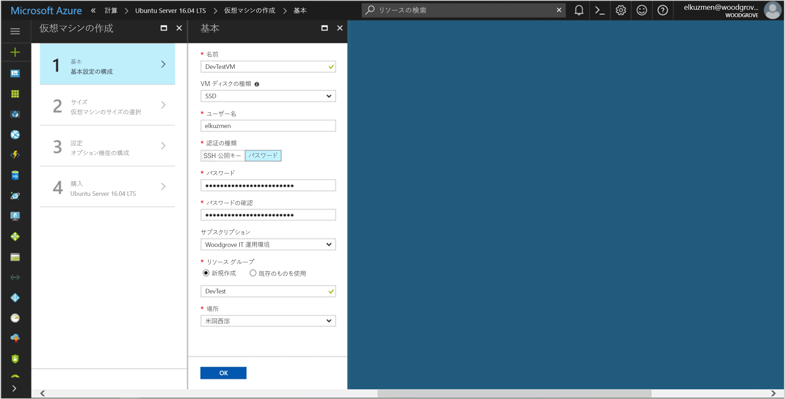
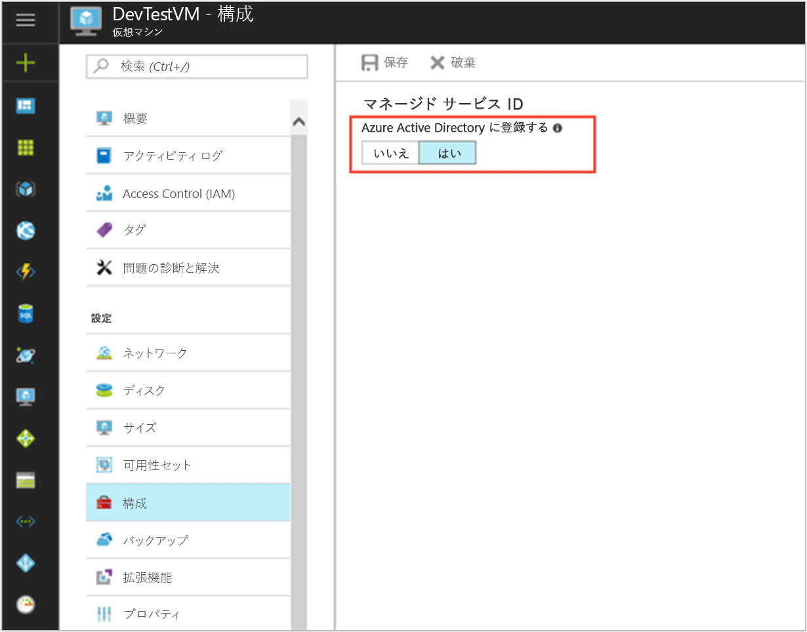

# <a name="tutorial-use-a-linux-vm-managed-service-identity-to-access-azure-storage-via-a-sas-credential"></a>チュートリアル: Linux VM マネージド サービス ID を使用して SAS 資格情報で Azure Storage にアクセスする

[!INCLUDE[preview-notice](../../../includes/active-directory-msi-preview-notice.md)]

このチュートリアルでは、Linux 仮想マシンのマネージド サービス ID を有効にした後、そのマネージド サービス ID を使用してストレージ Shared Access Signature (SAS) 資格情報を取得する方法について説明します。 具体的には [Service SAS 資格情報](/azure/storage/common/storage-dotnet-shared-access-signature-part-1?toc=%2fazure%2fstorage%2fblobs%2ftoc.json#types-of-shared-access-signatures)です。 

Service SAS は、アカウント アクセス キーを公開することなく、ストレージ アカウント内のオブジェクトへの限られたアクセス許可を限られた時間にわたって特定のサービス (ここでは BLOB サービス) に対してのみ提供できます。 ストレージ SDK の使用時など、ストレージ操作を実行するときに、SAS 資格情報を通常どおりに使用できます。 このチュートリアルでは、Azure Storage CLI を使用して BLOB のアップロードとダウンロードを行う手順を示します。 学習内容:


> [!div class="checklist"]
> * Linux 仮想マシンでマネージド サービス ID を有効にする 
> * Resource Manager で VM にストレージ アカウント SAS へのアクセス権を付与する 
> * VM の ID を使用してアクセス トークンを取得し、それを使用して Resource Manager から SAS を取得する 

## <a name="prerequisites"></a>前提条件

[!INCLUDE [msi-qs-configure-prereqs](../../../includes/active-directory-msi-qs-configure-prereqs.md)]

[!INCLUDE [msi-tut-prereqs](../../../includes/active-directory-msi-tut-prereqs.md)]

## <a name="sign-in-to-azure"></a>Azure へのサインイン
Azure Portal ([https://portal.azure.com](https://portal.azure.com)) にサインインします。


## <a name="create-a-linux-virtual-machine-in-a-new-resource-group"></a>新しいリソース グループに Linux 仮想マシンを作成する

このチュートリアルでは、新しい Linux VM を作成します。 既存の VM でマネージド サービス ID を有効にすることもできます。

1. Azure Portal の左上隅にある **[+/新しいサービスの作成]** ボタンをクリックします。
2. **[コンピューティング]**、**[Ubuntu Server 16.04 LTS]** の順に選択します。
3. 仮想マシンの情報を入力します。 **[認証の種類]** で、**[SSH 公開キー]** または **[パスワード]** を選択します。 作成した資格情報を使用して VM にログインできます。

    

4. ドロップダウンで仮想マシンの**サブスクリプション**を選択します。
5. 仮想マシンを作成する新しい**リソース グループ**を選択するには、**[新規作成]** を選択します。 完了したら、**[OK]** をクリックします。
6. VM のサイズを選択します。 その他のサイズも表示するには、**[すべて表示]** を選択するか、[サポートされるディスクの種類] フィルターを変更します。 設定ブレードで、既定値のまま **[OK]** をクリックします。

## <a name="enable-managed-service-identity-on-your-vm"></a>VM でマネージド サービス ID を有効にする

仮想マシンのマネージド サービス ID を使用すると、コードに資格情報を挿入しなくても、Azure AD からアクセス トークンを取得できます。 VM でマネージド サービス ID を有効にすると、VM が Azure Active Directory に登録されて、そのマネージド ID が作成され、VM で ID が構成されます。 

1. 新しい仮想マシンのリソース グループに移動し、前の手順で作成した仮想マシンを選択します。
2. 左側の VM の [設定] の下にある **[構成]** をクリックします。
3. マネージド サービス ID を登録して有効にする場合は **[はい]** を選択し、無効にする場合は [いいえ] を選択します。
4. **[保存]** をクリックして構成を保存します。

    

## <a name="create-a-storage-account"></a>ストレージ アカウントの作成 

まだお持ちでない場合は、この時点でストレージ アカウントを作成します。  この手順をスキップし、既存のストレージ アカウントのキーに対するアクセス権を VM のマネージド サービス ID に付与することもできます。 

1. Azure Portal の左上隅にある **[+/新しいサービスの作成]** ボタンをクリックします。
2. **[ストレージ]**、次に **[ストレージ アカウント]** をクリックすると、新しい [ストレージ アカウントの作成] パネルが表示されます。
3. 後で使用する、ストレージ アカウントの**名前**を入力します。  
4. **[デプロイ モデル]** と **[アカウントの種類]** が "Resource manager" と "General purpose" にそれぞれ設定されている必要があります。 
5. **[サブスクリプション]** と **[リソース グループ]** が、前の手順で VM を作成したときに指定したものと一致していることを確認します。
6. **Create** をクリックしてください。

    

## <a name="create-a-blob-container-in-the-storage-account"></a>ストレージ アカウントに BLOB コンテナーを作成する

後で、新しいストレージ アカウントにファイルをアップロードおよびダウンロードします。 ファイルには Blob Storage が必要であるため、ファイルを格納する BLOB コンテナーを作成する必要があります。

1. 新たに作成したストレージ アカウントに戻ります。
2. 左側のパネルで、[Blob service] の下の **[コンテナー]** リンクをクリックします。
3. ページの上部にある **[+ コンテナー]** をクリックすると、[新しいコンテナー] パネルがスライドして現れます。
4. コンテナーに名前を付け、アクセス レベルを選択して、**[OK]** をクリックします。 指定した名前は、後ほどチュートリアルで使用されます。 

    

## <a name="grant-your-vms-managed-service-identity-access-to-use-a-storage-sas"></a>VM のマネージド サービス ID にストレージ SAS を使用するためのアクセス権を付与する 

Azure Storage は、ネイティブでは Azure AD 認証をサポートしていません。  ただし、マネージド サービス ID を使用して Resource Manager からストレージ SAS を取得し、その SAS を使用してストレージにアクセスできます。  この手順では、ストレージ アカウントの SAS に対するアクセス権を VM のマネージド サービス ID に付与します。   

1. 新たに作成したストレージ アカウントに戻ります。   
2. 左側のパネルの **[アクセス制御 (IAM)]** リンクをクリックします。  
3. ページの上部にある **[+ 追加]** をクリックして、VM 用に新しいロールの割り当てを追加します。
4. ページの右側で、**[ロール]** を ［ストレージ アカウントの共同作業者］ に設定します。 
5. 次のドロップダウンで、**[アクセスの割り当て先]** を ［仮想マシン］ リソースに設定します。  
6. 次に、適切なサブスクリプションが **[サブスクリプション]** ドロップダウンにリストされていることを確認してから、**[リソース グループ]** を [すべてのリソース グループ] に設定します。  
7. 最後に、**[選択]** のドロップダウンで Linux 仮想マシンを選択し、**[保存]** をクリックします。  

    

## <a name="get-an-access-token-using-the-vms-identity-and-use-it-to-call-azure-resource-manager"></a>VM ID を使用してアクセス トークンを取得し、そのアクセス トークンを使用して Azure Resource Manager を呼び出す

チュートリアルの残りの部分では、以前に作成した VM から作業を行います。

これらの手順を完了するには、SSH クライアントが必要です。 Windows を使用している場合は、[Windows Subsystem for Linux](https://msdn.microsoft.com/commandline/wsl/install_guide) で SSH クライアントを使用することができます。 SSH クライアント キーの構成について支援が必要な場合は、「[Azure 上の Windows で SSH キーを使用する方法](../../virtual-machines/linux/ssh-from-windows.md)」または「[Azure に Linux VM 用の SSH 公開キーと秘密キーのペアを作成して使用する方法](../../virtual-machines/linux/mac-create-ssh-keys.md)」をご覧ください。

1. Azure Portal で **[Virtual Machines]** にナビゲートして Linux 仮想マシンに移動し、**[概要]** ページの上部にある **[接続]** をクリックします。 VM に接続する文字列をコピーします。 
2. SSH クライアントを使用して VM に接続します。  
3. 次に、**Linux VM** の作成時に追加した**パスワード**の入力を求められます。 パスワードを入力すると、正常にサインインできます。  
4. CURL を使用して Azure Resource Manager のアクセス トークンを取得します。  

    アクセス トークンの CURL 要求と応答を次に示します。
    
    ```bash
    curl 'http://169.254.169.254/metadata/identity/oauth2/token?api-version=2018-02-01&resource=https%3A%2F%2Fmanagement.azure.com%2F' -H Metadata:true    
    ```
    
    > [!NOTE]
    > 前述の要求では、"resource" パラメーターの値は、Azure AD で予期される値と完全に一致している必要があります。 Azure Resource Manager のリソース ID を使用する場合は、URI の末尾にスラッシュを含める必要があります。
    > 次の応答では、簡潔にするため access_token 要素が短縮されています。
    
    ```bash
    {"access_token":"eyJ0eXAiOiJ...",
    "refresh_token":"",
    "expires_in":"3599",
    "expires_on":"1504130527",
    "not_before":"1504126627",
    "resource":"https://management.azure.com",
    "token_type":"Bearer"} 
     ```

## <a name="get-a-sas-credential-from-azure-resource-manager-to-make-storage-calls"></a>ストレージ呼び出しを行うために Azure Resource Manager から SAS 資格情報を取得する

ここで、CURL を使用して、前のセクションで取得したアクセス トークンで Resource Manager を呼び出し、ストレージ SAS 資格情報を作成します。 SAS 資格情報を取得したら、ストレージのアップロード/ダウンロード操作を呼び出すことができます。

この要求のために、次の HTTP 要求のパラメーターを使用して SAS 資格情報を作成します。

```JSON
{
    "canonicalizedResource":"/blob/<STORAGE ACCOUNT NAME>/<CONTAINER NAME>",
    "signedResource":"c",              // The kind of resource accessible with the SAS, in this case a container (c).
    "signedPermission":"rcw",          // Permissions for this SAS, in this case (r)ead, (c)reate, and (w)rite.  Order is important.
    "signedProtocol":"https",          // Require the SAS be used on https protocol.
    "signedExpiry":"<EXPIRATION TIME>" // UTC expiration time for SAS in ISO 8601 format, for example 2017-09-22T00:06:00Z.
}
```

これらのパラメーターは、SAS 資格情報に対する要求の POST 本文に含まれます。 SAS 資格情報を作成するためのパラメーターの詳細については、[List Service SAS REST リファレンス](/rest/api/storagerp/storageaccounts/listservicesas)に関する記事を参照してください。

次の CURL 要求を使用して、SAS 資格情報を取得できます。 `<SUBSCRIPTION ID>`、`<RESOURCE GROUP>`、`<STORAGE ACCOUNT NAME>`、`<CONTAINER NAME>`、および `<EXPIRATION TIME>` の各パラメーターの値は、必ず実際の値に置き換えてください。 `<ACCESS TOKEN>` の値は、以前に取得したアクセス トークンに置き換えます。

```bash 
curl https://management.azure.com/subscriptions/<SUBSCRIPTION ID>/resourceGroups/<RESOURCE GROUP>/providers/Microsoft.Storage/storageAccounts/<STORAGE ACCOUNT NAME>/listServiceSas/?api-version=2017-06-01 -X POST -d "{\"canonicalizedResource\":\"/blob/<STORAGE ACCOUNT NAME>/<CONTAINER NAME>\",\"signedResource\":\"c\",\"signedPermission\":\"rcw\",\"signedProtocol\":\"https\",\"signedExpiry\":\"<EXPIRATION TIME>\"}" -H "Authorization: Bearer <ACCESS TOKEN>"
```

> [!NOTE]
> 前述の URL のテキストでは大文字小文字が区別されるので、リソース グループに使用されている大文字小文字が正しく反映されていることを確認してください。 さらに、これは POST 要求であり、GET 要求ではないことを知っておくことが重要です。

CURL 応答は、SAS 資格情報を返します。  

```bash 
{"serviceSasToken":"sv=2015-04-05&sr=c&spr=https&st=2017-09-22T00%3A10%3A00Z&se=2017-09-22T02%3A00%3A00Z&sp=rcw&sig=QcVwljccgWcNMbe9roAJbD8J5oEkYoq%2F0cUPlgriBn0%3D"} 
```

BLOB ストレージ コンテナーにアップロードするサンプル BLOB ファイルを作成します。 Linux VM でこれを行うには、次のコマンドを使用します。 

```bash
echo "This is a test file." > test.txt
```

次に、SAS 資格情報を使用して CLI `az storage` コマンドで認証を行い、ファイルを BLOB コンテナーにアップロードします。 この手順では、VM に[最新の Azure CLI をインストールする](https://docs.microsoft.com/cli/azure/install-azure-cli)必要があります (まだインストールされていない場合)。

```azurecli-interactive
 az storage blob upload --container-name 
                        --file 
                        --name
                        --account-name 
                        --sas-token
```

応答: 

```JSON
Finished[#############################################################]  100.0000%
{
  "etag": "\"0x8D4F9929765C139\"",
  "lastModified": "2017-09-21T03:58:56+00:00"
}
```

さらに、Azure CLI を使用してファイルをダウンロードし、SAS 資格情報を使用して認証することもできます。 

要求: 

```azurecli-interactive
az storage blob download --container-name
                         --file 
                         --name 
                         --account-name
                         --sas-token
```

応答: 

```JSON
{
  "content": null,
  "metadata": {},
  "name": "testblob",
  "properties": {
    "appendBlobCommittedBlockCount": null,
    "blobType": "BlockBlob",
    "contentLength": 16,
    "contentRange": "bytes 0-15/16",
    "contentSettings": {
      "cacheControl": null,
      "contentDisposition": null,
      "contentEncoding": null,
      "contentLanguage": null,
      "contentMd5": "Aryr///Rb+D8JQ8IytleDA==",
      "contentType": "text/plain"
    },
    "copy": {
      "completionTime": null,
      "id": null,
      "progress": null,
      "source": null,
      "status": null,
      "statusDescription": null
    },
    "etag": "\"0x8D4F9929765C139\"",
    "lastModified": "2017-09-21T03:58:56+00:00",
    "lease": {
      "duration": null,
      "state": "available",
      "status": "unlocked"
    },
    "pageBlobSequenceNumber": null,
    "serverEncrypted": false
  },
  "snapshot": null
}
```

## <a name="next-steps"></a>次の手順

このチュートリアルでは、Linux 仮想マシン上のマネージド サービス ID を使用し、SAS 資格情報を使用して Azure Storage にアクセスする方法について説明します。  Azure Storage SAS の詳細については、以下を参照してください。

> [!div class="nextstepaction"]
>[Shared Access Signatures (SAS) の使用](/azure/storage/common/storage-dotnet-shared-access-signature-part-1)
