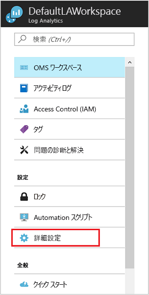

# Configuration Manager を Log Analytics に接続する
お使いの System Center Configuration Manager 環境を Azure Log Analytics に接続して、デバイス コレクション データを同期し、Log Analytics と Azure Automation でこれらのコレクションを参照することができます。  

## 前提条件

Log Analytics では、System Center Configuration Manager の現在のブランチ (バージョン 1606 以降) をサポートしています。  

## 構成の概要
次の手順は、Configuration Manager と Log Analytics の統合を構成する手順をまとめたものです。  

1. Azure Portal で Configuration Manager を Web アプリケーションまたは Web API アプリとして登録し、Azure Active Directory への登録によるクライアント ID およびクライアント秘密鍵を持っていることを確認します。 この手順の詳細については、「[リソースにアクセスできる Active Directory アプリケーションとサービス プリンシパルをポータルで作成する](../azure-resource-manager/resource-group-create-service-principal-portal.md)」を参照してください。
2. Azure Portal で、[Configuration Manager (登録した Web アプリ) に Log Analytics へのアクセス許可を付与](#grant-configuration-manager-with-permissions-to-log-analytics)します。
3. Configuration Manager で、[OMS 接続の追加ウィザードを使用して接続を追加](#add-an-oms-connection-to-configuration-manager)します。
4. パスワードまたはクライアント秘密鍵が期限切れになるか、それらを紛失した場合は、Configuration Manager で、[接続プロパティを更新](#update-oms-connection-properties)します。
5. Configuration Manager サービス接続ポイントのサイト システムの役割を実行しているコンピューターに、[Microsoft Monitoring Agent をダウンロードしてインストール](#download-and-install-the-agent)します。 エージェントは、Configuration Manager のデータを Log Analytics ワークスペースに送信します。
6. Log Analytics で、コンピューター グループとして [Configuration Manager からコレクションをインポート](#import-collections)します。
7. Log Analytics で、Configuration Manager からのデータを[コンピューター グループ](log-analytics-computer-groups.md)として表示します。

Configuration Manager と OMS の接続の詳細については、「[Sync data from Configuration Manager to the Microsoft Operations Management Suite (Configuration Manager のデータを Microsoft Operations Management Suite に同期する)](https://technet.microsoft.com/library/mt757374.aspx)」を参照してください。

## Configuration Manager に Log Analytics へのアクセス許可を付与する
次の手順では、前に Configuration Manager 用に作成した AD アプリケーションとサービス プリンシパルに、Log Analytics ワークスペースの "*共同作成者*" ロールを付与します。  まだワークスペースがない場合は、続行する前に「[Azure Log Analytics でワークスペースを作成する](log-analytics-quick-create-workspace.md)」をご覧ください。  これにより、Configuration Manager は認証を行って Log Analytics ワークスペースに接続できます。  

> [!NOTE]
> Log Analytics へのアクセス許可を Configuration Manager に指定する必要があります。 そうしないと、Configuration Manager で構成ウィザードを使用するときにエラー メッセージが表示されます。
>

1. Azure Portal の左上隅にある **[すべてのサービス]** をクリックします。 リソースの一覧で、「**Log Analytics**」と入力します。 入力を始めると、入力内容に基づいて、一覧がフィルター処理されます。 **[Log Analytics]** を選択します。       
2. Log Analytics ワークスペースの一覧で、変更するワークスペースを選びます。
3. 左側のウィンドウで **[アクセス制御 (IAM)]** を選びます。
4. [アクセス制御] ページで、**[追加]** をクリックして **[アクセス許可の追加]** ウィンドウを表示します。
5. **[アクセス許可の追加]** ウィンドウの **[ロール]** ドロップダウン リストで、**[共同作成者]** ロールを選びます。  
6. **[アクセスの割り当て先]** ドロップダウン リストで、前に AD で作成した Configuration Manager アプリケーションを選び、**[OK]** をクリックします。  

## エージェントのダウンロードとインストール
記事「[Windows コンピューターを Azure の Log Analytics サービスに接続する](log-analytics-agent-windows.md)」を読み、 Configuration Manager サービス接続ポイントのサイト システムの役割をホストしているコンピューターに Microsoft Monitoring Agent をインストールする方法を理解します。  

## Configuration Manager に OMS 接続を追加する
OMS 接続を追加するには、Configuration Manager 環境に[サービス接続ポイント](https://technet.microsoft.com/library/mt627781.aspx)があり、オンライン モード用に構成されている必要があります。

1. Configuration Manager の **[管理]** ワークスペースで、**[OMS コネクタ]** を選択します。 これで、**OMS 接続の追加ウィザード**が開かれます。 **[次へ]** を選択します。
2. **[全般]** 画面で、以下の操作が完了していることと、各項目の詳細を把握していることを確認し、**[次へ]** を選択します。

   1. Azure Portal で、Configuration Manager を Web アプリケーションまたは Web API アプリとして登録し、[登録からクライアント ID](../active-directory/develop/quickstart-v1-integrate-apps-with-azure-ad.md) を取得した。
   2. Azure Portal で、Azure Active Directory に登録したアプリのアプリ秘密鍵を作成した。  
   3. Azure Portal で、登録した Web アプリに OMS へのアクセス許可を付与した。  
      ![OMS への接続ウィザードの [全般] ページ](./media/log-analytics-sccm/sccm-console-general01.png)
3. **[Azure Active Directory]** 画面で、Log Analytics への接続設定を構成します。**[テナント]**、**[クライアント ID]**、および **[クライアントの秘密鍵]** を指定してから、**[次へ]** を選びます。  
   ![OMS への接続ウィザードの [Azure Active Directory] ページ](./media/log-analytics-sccm/sccm-wizard-tenant-filled03.png)
4. 他の手順がすべて正常に完了している場合は、**[OMS Connection Configuration (OMS 接続の構成)]** 画面の情報がこのページに自動的に表示されます。 接続設定の情報が表示されるのは、**[Azure サブスクリプション]**、**[Azure リソース グループ]**、および **[Operations Management Suite ワークスペース]** です。  
   ![OMS への接続ウィザードの [OMS 接続] ページ](./media/log-analytics-sccm/sccm-wizard-configure04.png)
5. ウィザードは、入力された情報を使って、Log Analytics サービスに接続します。 サービスと同期するデバイス コレクションを選び、**[追加]** をクリックします。  
   
6. **[概要]** 画面で接続の設定を確認し、**[次へ]** を選択します。 **[進行状況]** 画面に接続の状態が表示され、その後 **[完了]** になります。

> [!NOTE]
> 階層の最上層サイトを Log Analytics に接続する必要があります。 スタンドアロン プライマリ サイトを Log Analytics に接続した後で、環境に中央管理サイトを追加する場合は、接続を削除し、新しい階層内で接続を再作成する必要があります。
>
>

Configuration Manager を Log Analytics にリンクした後、コレクションを追加または削除したり、接続のプロパティを表示したりすることができます。

## Log Analytics の接続プロパティを更新する
パスワードまたはクライアント秘密鍵が期限切れになるか、それらを紛失した場合は、Log Analytics の接続プロパティを手動で更新する必要があります。

1. Configuration Manager で **[Cloud Services]** に移動し、**[OMS コネクタ]** を選択して、**[OMS Connection Properties]\(OMS 接続プロパティ\)** ページを開きます。
2. このページで **[Azure Active Directory]** タブをクリックし、**[テナント]**、**[クライアント ID]**、**[Client secret key expiration (クライアントの秘密鍵の期限切れ)]** を表示します。 **クライアントの秘密鍵**が期限切れかどうかを**確認**します。

## コレクションをインポートする
OMS 接続を Configuration Manager に追加し、Configuration Manager サービス接続ポイントのサイト システムの役割を実行しているコンピューターにエージェントをインストールした後、次の手順は Configuration Manager からのコレクションをコンピューター グループとして Log Analytics にインポートすることです。

初期構成を完了して階層からデバイス コレクションをインポートした後は、メンバーシップを最新に保つために、コレクションのメンバーシップ情報が 3 時間ごとに取得されます。 この処理はいつでも無効にすることができます。

1. Azure Portal の左上隅にある **[すべてのサービス]** をクリックします。 リソースの一覧で、「**Log Analytics**」と入力します。 入力を始めると、入力内容に基づいて、一覧がフィルター処理されます。 **[Log Analytics]** を選択します。
2. Log Analytics ワークスペースの一覧で、Configuration Manager が登録されているワークスペースを選びます。  
3. **[詳細設定]** を選択します。       
4. **[コンピューター グループ]** を選び、**[SCCM]** を選びます。  
5. **[Configuration Manager コレクション メンバーシップをインポートする]** を選択し、**[保存]** をクリックします。  
   ![コンピューター グループ - [SCCM] タブ](./media/log-analytics-sccm/sccm-computer-groups01.png)

## Configuration Manager のデータを表示する
OMS 接続を Configuration Manager に追加し、Configuration Manager サービス接続ポイントのサイト システムの役割を実行しているコンピューターにエージェントをインストールすると、エージェントからのデータが Log Analytics に送信されます。 Log Analytics で、Configuration Manager コレクションが[コンピューター グループ](log-analytics-computer-groups.md)として表示されます。 グループは、**[Configuration Manager]** ページの **[設定] > [コンピューター グループ]** で見ることができます。

コレクションがインポートされると、コレクションのメンバーシップを持つコンピューターが何台検出されたかを確認できます。 インポートされたコレクションの数を確認することもできます。

![コンピューター グループ - [SCCM] タブ](./media/log-analytics-sccm/sccm-computer-groups02.png)

いずれかをクリックすると、[検索] が開き、インポートされたすべてのグループか、各グループに属しているすべてのコンピューターが表示されます。 [ログの検索](log-analytics-log-searches.md)を使用して、Configuration Manager のデータの詳細な分析を開始することができます。

## 次の手順
* [ログの検索](log-analytics-log-searches.md)を使用して、Configuration Manager のデータに関する詳細な情報を表示します。
